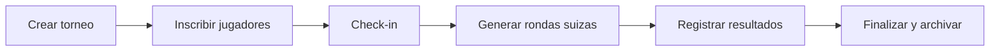

# Roadmap — Iteración 2: Multi-torneo

Documento de referencia para el siguiente ciclo de desarrollo. **No implementado en la iteración actual.**

## Motivación

- Juntas de juego informales donde la comunidad crea mini-torneos sobre la marcha.
- Taller del colegio de ajedrez: el organizador necesita inscribir alumnos y generar pareos rápidamente.

## Alcance previsto (reducido)

La herramienta multi-torneo se centraría en:

1. **Inscripción** de jugadores.
2. **Check-in** y **pareos automáticos** (formato suizo, reutilizando `swiss-pairing.ts`).

No incluiría landing elaborada por torneo ni vistas kiosk/live por evento en esta fase.

## Cambios de modelo

| Área | Cambio |
|------|--------|
| `tournaments` | Flag o tipo (`official`, `community`) para distinguir torneos archivados públicos vs. internos |
| Resolución | `getTournamentBySlug(slug)` + torneo activo para inscripciones |
| Admin | CRUD para crear torneos (nombre, fecha, cupo, rondas planificadas) |
| Home | Lista de archivos públicos + CTA al torneo activo si existe |
| Slug | Un slug único por torneo; `PUBLIC_TOURNAMENT_SLUG` como fallback |
| Galería / export | Ya scoped por `tournamentId` desde iteración 1 |

## Flujo rápido (borrador)

## Fuera de alcance (iteración 2)

- UI de eliminatoria (knockout).
- Kiosk / live dedicados por torneo.
- Landing personalizada por evento.
